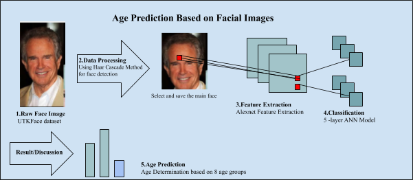
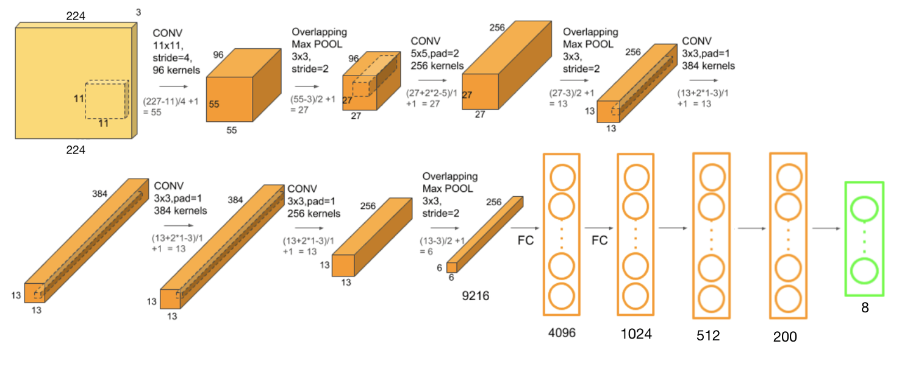
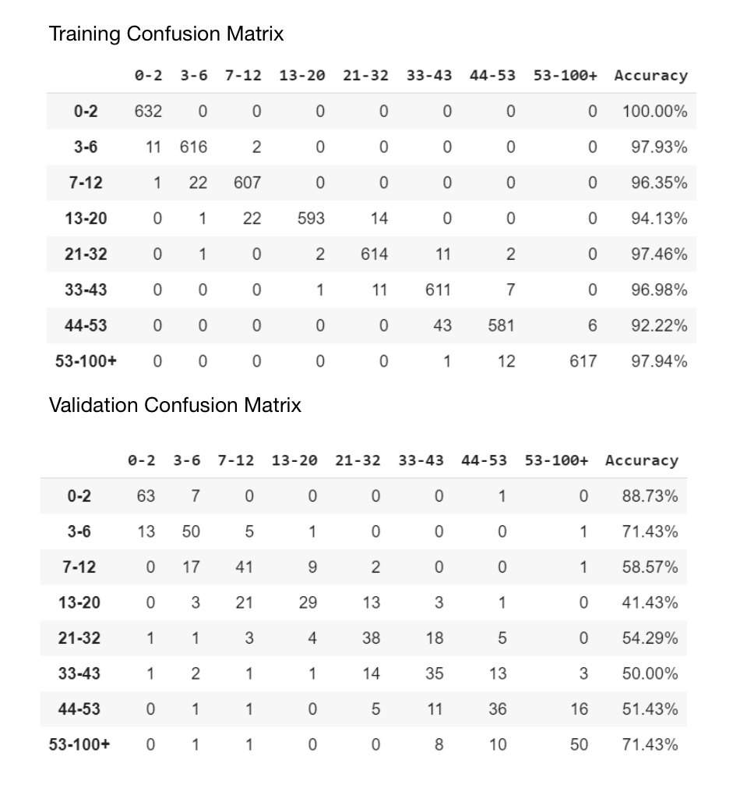

# Age-Detector

One sentence project description: Develop a machine learning model that can perform age detection.

## Illustration:

Figure author: Tommy Zhou

## Details

### Data

Dataset: [UTKFaces](https://susanqq.github.io/UTKFace/)

Images are split into 8 imbalanced age classes. To decrease bias in prediction, we preprocessed the dataset so the 8 classes are balanced, each class contains 770 images.

Data Processing: 
- Identify faces: [Haar-cascade](https://docs.opencv.org/3.4/db/d28/tutorial_cascade_classifier.html)
- We developed a small algorithm that is able the choose the "main face" from a given image

### Architecture

Five convolutional layers from AlexNet + Five fully connected layers.

Figure author: Yu Xin Cheng

### Result

Final Accuracy: 61.27% validation accuracy 

## Contributor

Carter Huang

[Chenhong Qiu](https://github.com/CChongQ)

Tommy Zhou

Yu Xin Cheng
